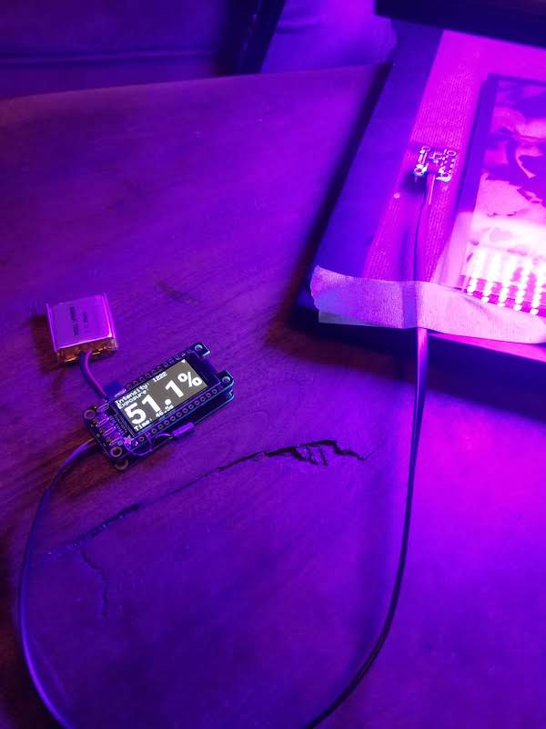

# arduino_blueprint
An Adafruit Feather based UV exposure meter for making cyanotypes and other alt process prints



## Raw Exposure mode
By default, Blueprint starts in Raw Exposure mode when it powers on. You can tell you're in raw exposure mode because the exposure value will _not_ have a percent symbol (%) after it

Use this mode to determine an exposure value that works well for a given negative. Then note the value after exposing and make adjustments depending on the result of the print. Save this number to set up target exposure mode.

## Target Exposure mode
Target exposure mode will take an exposure value determined in Raw Exposure mode and then display the exposure as a percentage of that raw value. Use this mode when printing a negative where you've already determined your desired exposure previously. You know you are in Target Exposure mode when the exposure value ends with a percent sign (%).

To enter a target exposure, make sure Blueprint is connected to wifi. There will be an antenna symbol in the upper right corner. Then, on a device connected to the same network, navigate to http://blueprint.local/set/10000 . This will set the target exposure to 10,000 units. To set a different value, edit the URL with the desired value. Exposures you use often can be bookmarked or kept as links in a table with information about your negatives for example.

Note: Blueprint uses a technology called "mdns" to make itself available on your local network via the "cooker.local" domain name. Unfortnately, as of spring 2022, mdns is not widely supported on Android devices. If you are having trouble connecting, search the internet to find out if your device supports mdns. 

## Reseting exposure
The exposure may be reset by navigating to http://blueprint.local/reset while the Blueprint is connected to wifi. Alternatively, pressing the reset button on the Blueprint will reboot the device thererby reseting the exposure as well.

## Connecting to WiFi
Edit the file `arduino_blueprint.ino`. Look for these lines and change their values, leaving the "quote marks" intact:
```arduino_blueprint.ino
#define WIFI_SSID "your ssid"
...
#define WIFI_PASSWORD "enter your wifi password here"
```

After uploading the sketch, when the Blueprint powers on, it will show "Connecting to your_ssid..." on the screen. Ensure this matches the ssid that you set. While the Blueprint is connected to wifi, there will be a small antenna symbol in the upper right corner of the screen. Navigate to http://blueprint.local/ on a device connected to the same network to see a simple home page with example links to the set and reset functions.

# Hardware
- Adafruit HUZZAH32 – ESP32 Feather Board 
  - [https://www.adafruit.com/product/3405](https://www.adafruit.com/product/3405)
  - Note: Other wifi-enabled boards should be compatible but haven't been tested
- Adafruit FeatherWing OLED - 128x64 OLED Add-on For Feather - STEMMA QT / Qwiic 
  - [https://www.adafruit.com/product/4650](https://www.adafruit.com/product/4650)
- Adafruit LTR390 UV Light Sensor - STEMMA QT / Qwiic
  - [https://www.adafruit.com/product/4831](https://www.adafruit.com/product/48310
